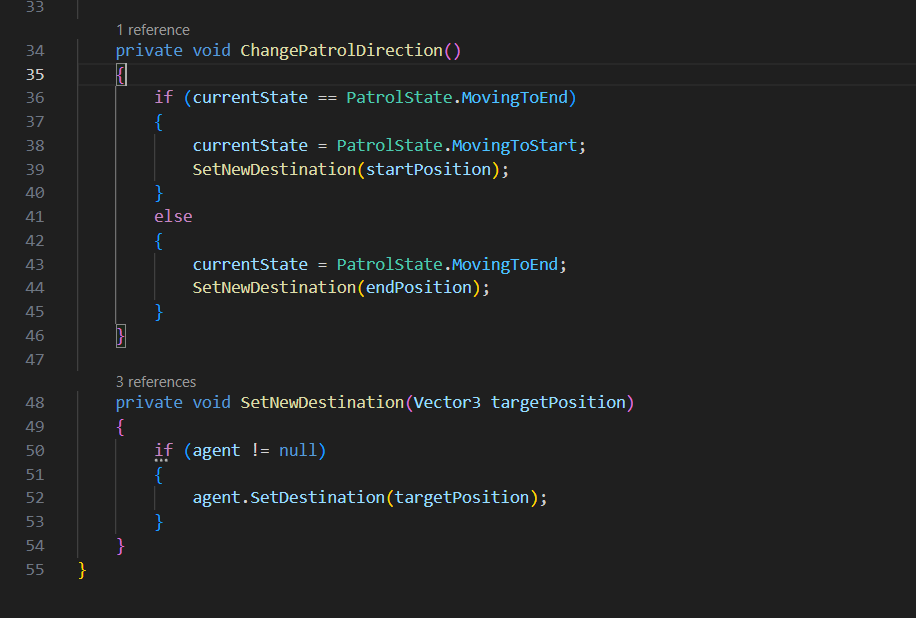

# The Last Cemi

  
  
<i></i>

  
  
<i></i>

## Integrantes del equipo
- Debbimar Díaz Santiago
- Jonlier Díaz Rivera
- Jeremy Curry Romero

## Enlace para descargar juego
[Enlace del juego](https://sistemaupr-my.sharepoint.com/:u:/g/personal/jonlier_diaz_upr_edu/IQAARw3F2DYDSbPxkaHwsBAnAWy6NlUvPrl_F1cwa1j5a58?e=dRynPz)

## Gameplay

Para iniciar el juego se debe estar en la escena de *StartScreen*. Una vez en la escena se da play en *Unity*. Para jugar el movimiento del jugador es con las teclas WASD y para el movimiento de cámara el mouse. Debes entrar a la cueva y completar el laberinto, durante el camino te encontrarás con enemigos. Evita que te vean! Si te atrapan deberás comenzar desde el inicio. Encuentra el camino que te lleve al último cemí!

## Historia

Cuando los españoles llegaron a Puerto Rico, las personas que ya habitaban la isla, los indios taínos, pensaron que ellos eran dioses. Esto se debía a su apariencia física, sus barbas, sus armaduras y sus caballos. Como los taínos eran naturalmente bondadosos y hospitalarios, los trataron con respeto. Les ofrecieron comida, tributos y refugio. Gracias a esta hospitalidad, los españoles, durante meses e incluso por algunos años, se aprovecharon de los taínos y les robaron muchos recursos.

Con el paso del tiempo, uno de los indios más bondadosos, pero también valiente y rebelde, llamado Guarionex, comenzó a dudar de la supuesta divinidad de los españoles. Había notado que estos se enfermaban, sangraban y morían al igual que ellos. Estas dudas lo llevaron a reunirse con varios taínos para compartir sus inquietudes. Al coincidir con su manera de pensar, decidieron comprobar si los españoles eran realmente dioses.

Para hacerlo, ahogaron a un español y escondieron su cuerpo en un lugar apartado, con la intención de observar qué ocurría con él después de varios días. Cuando Guarionex y su grupo regresaron al lugar, se dieron cuenta de que el cuerpo olía mal. Fue entonces cuando confirmaron que los españoles no eran dioses y que los habían estado utilizando.

Tras este descubrimiento, Guarionex y los demás taínos corrieron la verdad entre su gente y tomaron la decisión de rebelarse contra los españoles. Guarionex sabía que esta decisión muy probablemente provocaría una guerra, y también era consciente de que los taínos se encontraban en desventaja, ya que los españoles contaban con más hombres y armas más avanzadas. Por esta razón, comenzó a buscar una forma de proteger a su pueblo.

En su búsqueda, recordó una antigua leyenda que hablaba de un cemí oculto dentro de un laberinto, el cual otorgaba poderes sobrenaturales a quien lograra poseerlo. Decidido a hacer lo que fuera necesario para proteger a su gente, Guarionex buscó información entre los suyos hasta que finalmente logró encontrar el laberinto.

Con gran valentía, Guarionex enfrentó los numerosos retos que implicaba llegar hasta el artefacto sagrado y logró obtener el cemí. Al hacerlo, adquirió sus poderes y los utilizó para un propósito justo, la protección de su gente. Aun teniendo la capacidad de eliminar por completo a los españoles, Guarionex decidió mostrar misericordia. Derrotados y sin encontrar una manera de vencerlo, los españoles se vieron obligados a retroceder y abandonar la isla.

Gracias al sacrificio y valentía de Guarionex, los taínos pudieron continuar habitando Puerto Rico y vivir por muchas generaciones más. Guarionex se convirtió en un héroe y el protagonista de una gran victoria en la guerra de los taínos contra los españoles.

  
  
<i></i>

## Proceso

  
  
<i>Mapa del juego</i>

Se hizo el *terrain* 100x100 para el laberinto. Otro *terrain* 200x200 para el alrededor. Luego se convirtió en uno pero era para tener una idea de el tamaño. Se dibujó un modelo del laberinto y luego se intentó recrear con *cubes* 3D y usando la herramientas de mover y girar de ajustaron para que fuera lo más similar al modelo principal. Se bajaron unos *assets* gratis para texturas, el muñeco para *player* y un golem como *enemy*. Primero se programó el *player*, utilizando el *code* ya creado en clase solo se tuvo que modificar para que se pudiera girar hacia arriba y hacia abajo ya que era en primera persona. Se le agregaron componentes como la *capsule collider* y *rigidbody*. Se puso la *camera* a la altura de los ojos del *player* y como hijo del *prefab*. Luego se hizo el *prefab* del *enemy*, se utilizó también el *code* usado en clase pero con unas modificaciones ya que el propósito del *enemy* era que solo caminara hacia adelante y luego se girara hacia atrás en ciclo, en un *script* llamado EnemyPatrolCycle el cual se creó para esa función. A continuación parte del *code*:

  
  
<i>Script para enemy (1)</i>

  
  
<i>Script para enemy (2)</i>

Una vez terminado eso se le agregó el *NavMesh agent* y con el *NavMesh surface* se hizo bake para que el *enemy* pudiera caminar por las áreas del laberinto y comprobar que no se quedara estancado. Se hicieron 4 *scenes* en total, la primera es la pantalla de inicio (*StartScreen*) es como un interface para empezar el juego, se hizo uno para cuando el enemigo te atrapa y en donde puedes darle restart, la *scene* principal que es donde está el juego y por último la *scene* de *win screen* que es cuando el *player* encuentra el artefacto final completando así el recorrido del laberinto. Para que el enemigo solo reconociera al *player* se crearon los *layers* de *Player* y *enemy*, se puso los *layers* en los *prefabs* y que el *enemy* solo reconociera como *object* al *player*. Al artefacto también se le agregó el *AI* y se le puso casi lo mismo que al *enemy* pero en vez de que si reconoce al *player* cuando se acerca perder pues gana. En el *build profile* se agregaron las *scenes* para cuando fueran llamadas en el *code* pues las reconociera y se pusieron en orden de *Start*, *SampleScene*, *Lose*, *Win*. Para empezar el juego tenemos que estar metido en la *scene* de start que viene siendo como el interface de inicio y de esa manera se hace click en la pantalla (se programó con un bloque en el fondo y si se hace click en cualquier parte pues vaya a la próxima *scene*). Se utilizaron ambos *input system*, para el juego como tal se utilizó el componente de *input* con el nuevo sistema pero para los interface se utilizó un *script* con el *code* diciendo que si se hace click pues para la próxima *scene* con el *input system* viejo. Al final después de tener todo funcional se colocaron varios *enemy’s* dispersados en el laberinto de manera en que el *player* tenga que evitarlos durante el transcurso y si es atrapado tiene la opción de reiniciar el juego y comenzar desde el inicio hasta llegar al final del laberinto que es el cemi.

## Creación del cemí

  
  
<i>Cemí</i>

Para la creación del cemí, se utilizaron mayormente esferas y cápsulas, junto con un *prefab* de *ProBuilder* que se utilizó como “stand” y luego se decoró con piedras preciosas. El proceso fue el siguiente:

<ol type="1">
  <li>Se diseñó la cara del cemí utilizando una esfera, junto con los rasgos físicos que la componen. Como por ejemplo los ojos, la boca, etc.</li>
  <li>Se diseñaron los componentes alrededor de la cara utilizando cápsulas y ajustándoles el tamaño a cada una.</li>
  <li>Luego se le añadieron como unas “perlas” a cada componente que esta alrededor de la cara para que representara un artefacto de mucho valor.</li>
  <li>Luego utilizando <i>ProBuilder</i>, se le añadió un “stand” para el artefacto. Se utilizó un “shape” llamado pipe. Además, el mismo se decoró con piedras preciosas alrededor.</li>
  <li>Luego de haber terminado el diseño del cemí, comenzó el proceso de aplicarles texturas a ambos, al cemí y al stand. Al cemí se le aplicaron distintos tonos de oro y las perlas y algunos rasgos físicos se pintaron de plata.</li>
  <li>Luego se bajaron unas texturas del store y se le aplicaron al “stand” y a las piedras preciosas que estaban en el mismo.</li>
  <li>Por último, al cemí se le añadió el componente de <i>sight</i> con el fin de que cuando detectara al <i>player</i>, mandara al usuario al <i>WinScreen</i>. Básicamente se le hizo copy and paste al <i>sight</i> de <i>enemy</i>, pero con la diferencia de que se modificó para que en vez de que mandara al usuario al <i>LoseScreen</i> lo mandara al <i>WinScreen</i>.</li>
</ol>
