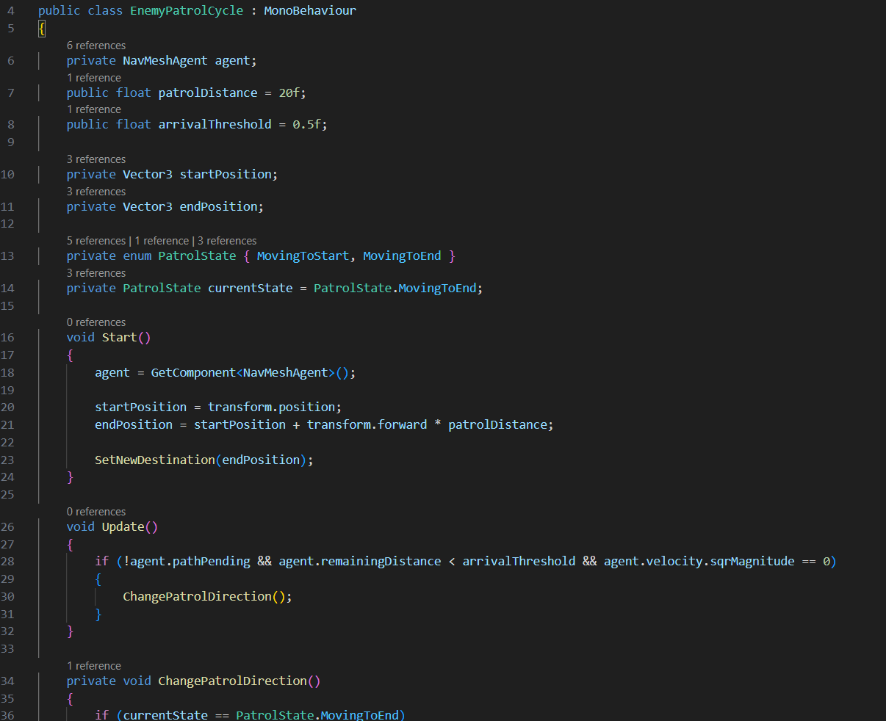

# VideoJuego_ProyectoFinal

# The Last Cemi

## Integrantes del equipo
- Debbimar Díaz Santiago
- Jonlier Díaz Rivera
- Jeremy Curry Romero

## Enlace para descargar juego

## Gameplay
Para iniciar el juego se debe estar en la escena de StartScreen. Una vez en la escena se da play en unity. Para jugar el movimiento del jugador es con las teclas WASD y para el movimiento de cámara el mouse. Debes entrar a la cueva y completar el laberinto, durante el camino te encontrarás con enemigos. Evita que te vean! Si te atrapan deberás comenzar desde el inicio. Encuentra el camino que te lleve al último cemí! 

## Historia
 
## Proceso
Se hizo el terreno 100x100 para el laberinto. Otro terreno 200x200 para el alrededor. Luego se convirtió en uno pero era para tener una idea de el tamaño. Se dibujó un modelo del laberinto y luego se intentó recrear con cubos 3D y usando la herramientas de mover y girar de ajustaron para que fuera lo más similar al modelo principal. Se bajaron unos assets gratis para texturas, el muñeco para player y un golem como enemy. Primero se programó el player, utilizando el código ya creado en clase solo se tuvo que modificar para que se pudiera girar hacia arriba y hacia abajo ya que era en primera persona. Se le agregaron componentes como la cápsula para el collider y rigid body. Se puso la cámara a la altura de los ojos del player y como hijo del prefab. Luego se hizo el prefab del enemy, se utilizó también el código usado en clase pero con unas modificaciones ya que el propósito del enemy era que solo caminara hacia adelante y luego se girara hacia atrás en ciclo, en un script llamado EnemyPatrolCycle el cual se creó para esa función. A continuación parte del código:

  
  
<i>Script para enemy.</i>

Una vez terminado eso se le agregó el NavMesh agent y con el navmesh surface se hizo bake para que el enemy pudiera caminar por las áreas del laberinto y comprobar que no se quedara estancado. Se hicieron 4 escenas en total, la primera es la pantalla de inicio (StartScreen) es como un interface para empezar el juego, se hizo uno para cuando el enemigo te atrapa y en donde puedes darle restart, la escena principal que es donde está el juego y por último la escena de win screen que es cuando el player encuentra el artefacto final completando así el recorrido del laberinto. Para que el enemigo solo reconociera al player se crearon los layers de Player y enemy, se puso los layers en los prefabs y que el enemy solo reconociera como objeto al player. Al artefacto también se le agregó el AI y se le puso casi lo mismo que al enemy pero en vez de que si reconoce al player cuando se acerca perder pues gana. En el build profile se agregaron las escenas para cuando fueran llamadas en el código pues las reconociera y se pusieron en orden de Start, SampleScene, Lose, Win. Para empezar el juego tenemos que estar metido en la escena de start que viene siendo como el interface de inicio y de esa manera se hace click en la pantalla (se programó con un bloque en el fondo y si se hace click en cualquier parte pues vaya a la próxima escena). Se utilizaron ambos inputsystem, para el juego como tal se utilizó el componente de input con el nuevo sistema pero para los interface se utilizó un script con el código diciendo que si se hace click pues para la próxima escena con el input system viejo. Al final después de tener todo funcional se colocaron varios enemy’s dispersados en el laberinto de manera en que el player tenga que evitarlos durante el transcurso y si es atrapado tiene la opción de reiniciar el juego y comenzar desde el inicio hasta llegar al final del laberinto que es el cemi.
